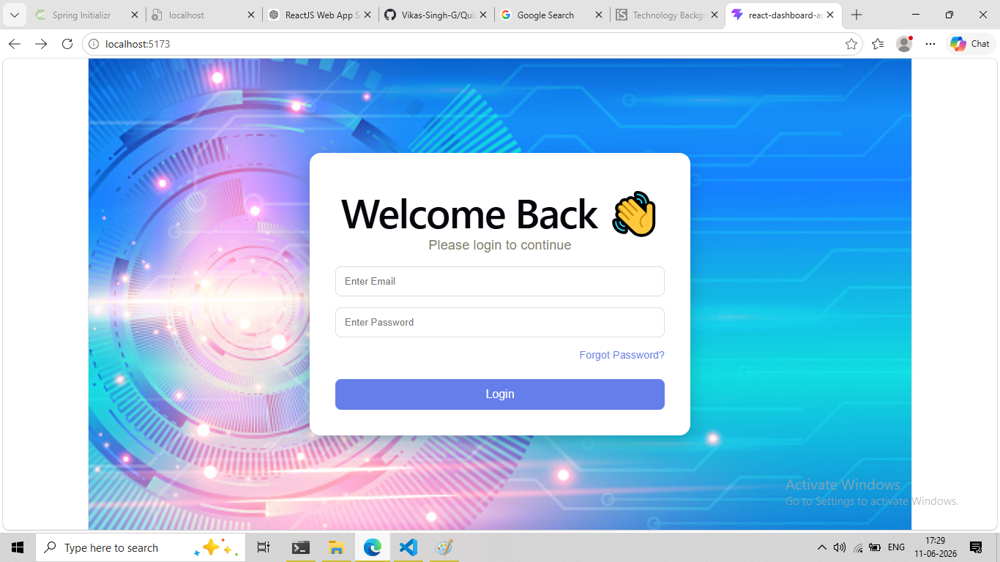
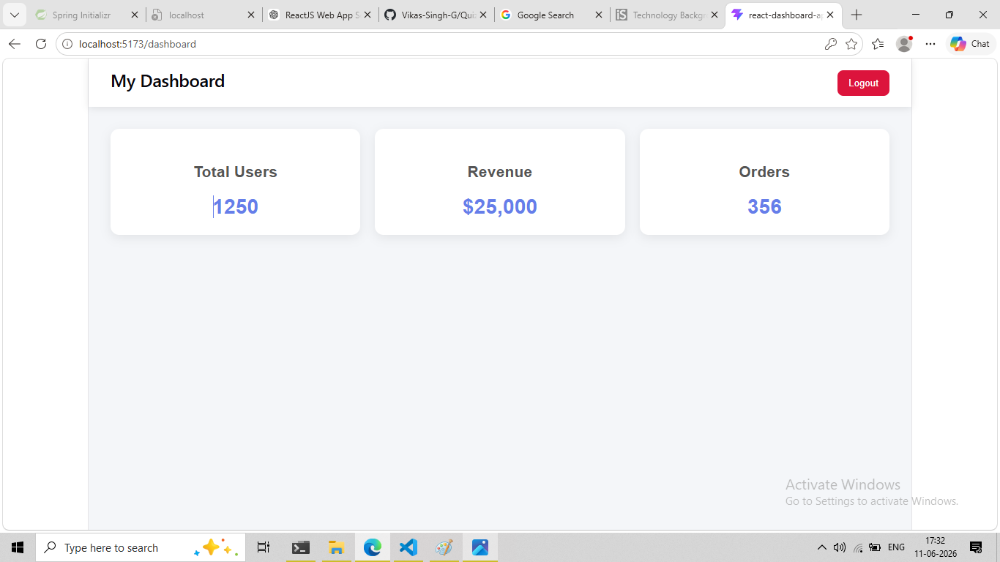
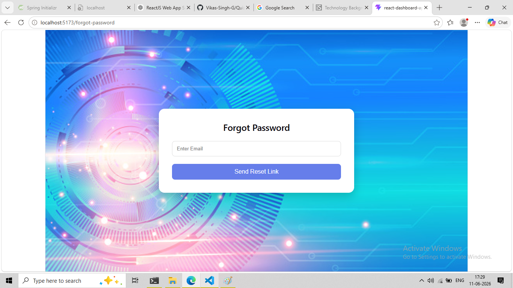
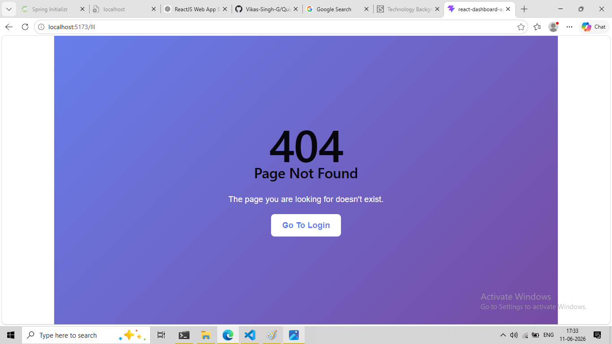

# React Dashboard App

A ReactJS dashboard application with authentication, protected routes, forgot password functionality, and custom 404 error handling.

## Features

* User Login Page
* Dashboard Page
* Protected Routes
* Forgot Password Page
* Custom 404 Page Not Found
* Responsive Design
* Modern UI with Background Image
* React Router Navigation

## Technologies Used

* ReactJS
* React Router DOM
* CSS3
* Vite

## Installation

Clone the repository:

```bash
git clone https://github.com/YOUR_USERNAME/react-dashboard-app.git
```

Navigate to the project:

```bash
cd react-dashboard-app
```

Install dependencies:

```bash
npm install
```

Run the application:

```bash
npm run dev
```

Open:

```text
http://localhost:5173
```

## Project Structure

```text
src
│
├── components
│   └── ProtectedRoute.jsx
│
├── pages
│   ├── Login.jsx
│   ├── Dashboard.jsx
│   ├── ForgotPassword.jsx
│   └── NotFound.jsx
│
├── styles
│   ├── Login.css
│   ├── Dashboard.css
│   └── NotFound.css
│
└── App.jsx
```

## Screenshots

### Login Page



### Dashboard Page



### Forgot Password



### 404 Page




